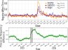
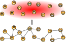
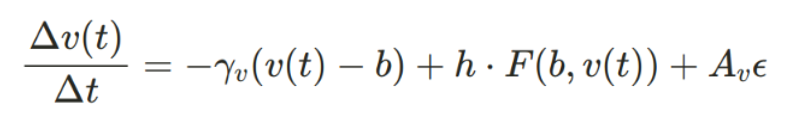
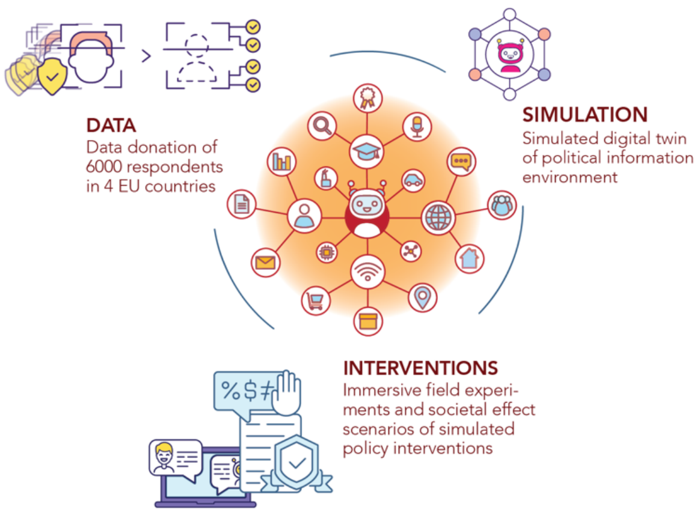
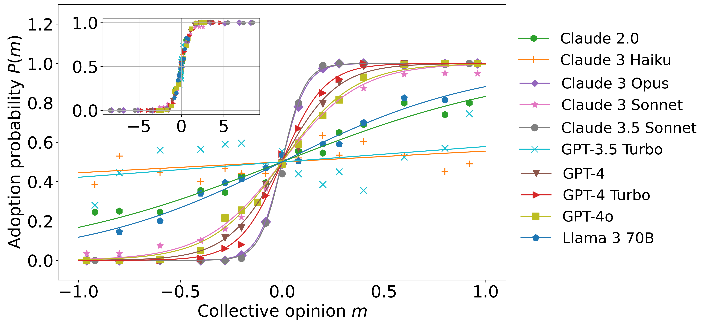

```{r xaringan-themer, include=FALSE, warning=FALSE}
#This block contains the theme configuration for the CSS lab slides style
library(xaringanthemer)
library(showtext)
style_mono_accent(
  base_color = "#5c5c5c",
  text_font_size = "1.5rem",
  header_font_google = google_font("Arial"),
  text_font_google   = google_font("Arial", "300", "300i"),
  code_font_google   = google_font("Fira Mono")
)
```

```{r setup, include=FALSE}
options(htmltools.dir.version = FALSE)
```


layout: true
<div class="my-footer"><span>David Garcia - From Digital Traces to Generative Agents</span></div>

---

background-image: url(figures/AboutUS.svg)
background-size: 98%


---

# Outline

### 1. Modelling Online Collective Behavior

### 2. Generative Agents Simulating Online Social Networks

### 3. The Scale of Coordination in AI Agents

---

## On Digital Traces and Agent-Based Models

.pull-left[

Human behavior from digital traces:  
e.g. Collective emotions on Twitter
]

.pull-right[


Explaining collective behavior:  
e.g. Agent-Based Modelling of collective emotions  
]

---

## The problem of calibrating agent microdynamics


.pull-left[


]

.pull-right[
- Example experiment: valence dynamics while reading thread

- Experiments for calibration, not hypothesis testing
- Simplifying interaction into a small set of variables
- Many assumptions in ABM: communication errors, treatment effects, heterogeneity...
]

[The Dynamics of Emotions in Online Interaction. David Garcia, Arvid Kappas, Dennis Küster, Frank Schweitzer. Royal Society Open Science (2016)](https://royalsocietypublishing.org/doi/10.1098/rsos.160059)

---

## Social Simulation with Generative Agents

**Can generative agents simplify assumptions in ABMs of online interaction?**

.pull-left[
<div class="ref"><span><a href="https://arxiv.org/pdf/2304.03442"> Generative Agents: Interactive Simulacra of Human Behavior. S. Park et al (2023)</a></span></div>]

.pull-right[.center[]
<div class="ref"><span><a href="https://arxiv.org/abs/2312.06619"> Simulating Social Media Using Large Language Models to Evaluate Alternative News Feed Algorithms. P. Törnberg et al (2023) </a></span></div>]

---
# The WHAT-IF HORIZON project

.center[]

WHat-if: Advanced Simulations for Testing the Effect of the Information Environment on the Functioning of Democracy 

---

layout: true
<div class="my-footer"><span><a href="https://arxiv.org/abs/2312.06619"> Emergence of Scale-Free Networks in Social Interactions among Large Language Models. G. De Marzo, L. Pietronero, D. Garcia. https://arxiv.org/abs/2312.06619</a></span></div>

---

# Generative Agents Simulating Online Social Networks

### 1. Modelling Online Collective Behavior

### *2. Generative Agents Simulating Online Social Networks*

### 3. The Scale of Coordination in AI Agents

---


## Online social networks can be scale free

.pull-left[]
.pull-right[

- Probability distribution of in-degrees (e.g. number of followers)
- Scale-free networks with power-law degree distributions:
$$ p(k) \sim k ^ {-\gamma} $$
- **Variance of degree distribution grows with network size**
- **No epidemic threshold: persistent infectious outbreaks**

]

[A Model for Scale-Free Networks: Application to Twitter. S. Aparicio, J. Villazón-Terrazas, G. Álvarez. Entropy (2015)](https://www.mdpi.com/1099-4300/17/8/5848)

---


## Generative agents in an online social network
.center[]

---
## Simulated networks: the problem of token priors

.center[]

- Extreme degree heterogeneity in original setup
- Broad degree distribution when hiding degrees!
- Prior on agent names: Zipf's law applies to random node names
- Friending user x is not the same as saying "I friend user x"


---

## Simulated networks with renaming interface

.center[]

- Random renaming between rounds: keeping node ids but changing names
- Token prior effect reduced: no degree info leads to narrow degree distribution
- We can model online network growth but we need to consider these are language models -- future models should include behavioral tokens


---

# Microdynamics of link creation
.center[]

- Generative agents with Large Language Models create scale-free synthetic online social networks  
<div class="ref"><span><a href="https://arxiv.org/abs/2312.06619"> Emergence of Scale-Free Networks in Social Interactions among Large Language Models. G. De Marzo, L. Pietronero, D. Garcia. https://arxiv.org/abs/2312.06619</a></span></div>

---


layout: true
<div class="my-footer"><span><a href="https://arxiv.org/abs/2409.02822"> Large Language Model agents can coordinate beyond human scale. G de Marzo, C. Castellano, D. Garcia. Arxiv preprint (2024)</a></span></div> 

---

# The Scale of Coordination in AI Agents

### 1. Modelling Online Collective Behavior

### 2. Generative Agents Simulating Online Social Networks

### *3. The Scale of Coordination in AI Agents*

---
# LLMs Within Society

.center[]
- AI "chiefs of staff" promise to interact with each other in our behalf
- Coordination and competition (reservations, negotiations, applications)
- **Could norms emerge, for example rules to be more efficient?** 
- **Could they have systemic risks, like flash crashes?**

---

# LLMs as Social Brains
.pull-left[]
.pull-right[

- Group formation and sustainability: size depends on cognitive ability


- Memory of identity to predict behavior and cooperation


- Language as a tool for humans to make larger groups:
  - Dunbar's number (150-250)

- Typical coordinated group size of AI agents?
]

---

# Coordination and Critical Group Size

.center[]

Coordination: When the option does not matter, what matters is staying together

---

# Coordination Dynamics in LLM Agents
.pull-left[.center[]]
.pull-right[
- Simulation of a tight group of N interacting agents
- Agents start with a random opinion of two options
- Each iteration, they see the opinions of all others (prompt)
- They respond to the question of their opinion
- Opinion labels need to be random and shuffled to avoid token biases
- Consensus is achieved if all have the same opinion
]

---

# LLM-Dependent Consensus Formation
.center[]
Some LLMs can reach consensus for completely arbitrary decisions (50 agents)

---

# Understanding LLM Opinion Dynamics

.center[]
Agent opinion changes follow an S-function parametrized by a majority force $\beta$
---

# Majority Force Factors
.center[]
- Majority force is higher for models with higher language understanding capabilities (MMLU benchmark)
- Majority force decreases for larger group sizes

---
## Critical Group Size and Consensus Time $T_c$
.pull-right[]

- Analysis of critical group size $N_c$


- $N>N_c$: time to consensus $T_c$ grows exponentially with $N$


- Above critical size, consensus is unfeasible and happens only by chance


- $T_c$ can be calculated from $\beta$ as in an Ising Model (i.e. time to magnetization as a function of inverse temperature)

- $N_c$ can be derived from  $\beta$ as the point of phase transition of $T_c$ ( $\beta_c=1$ )


---

# Group Size and Language Understanding
.pull-right[]

- Analysis of majority force and exhaustive simulations to measure **critical consensus size**

- Exponential function of MMLU benchmark

- Humans close to the line

- GPT4 and Claude 3.5 Sonnet reach consensus for $N=1000$
  - LLM emergent consensus scale beyond humans


---

# Summary

- An idea: Improving Agent-Based Modelling with generative agents (LLMs)
- Generative agents can create realistic social network degree distributions
- LLM consensus scale predicted by language understanding capabilities
- LLMs can reach emergent consensus at scales beyond humans
- **Opportunity: decision-making or coordination?**
- **Risk: undesired synchronization like a flash crash?**
- **Future: Social simulation with LLMs **

<a href="https://arxiv.org/abs/2312.06619"> Emergence of Scale-Free Networks in Social Interactions among Large Language Models. G. De Marzo, L. Pietronero, D. Garcia. Arxiv (2023) </a>

<a href="https://arxiv.org/abs/2409.02822"> Large Language Model agents can coordinate beyond human scale. G de Marzo, C. Castellano, D. Garcia. Arxiv (2024) </a>

.center[**More at: [www.dgarcia.eu](https://dgarcia.eu)** and **[Bluesky: @dgarcia.eu](https://bsky.app/profile/dgarcia.bsky.social)**]

